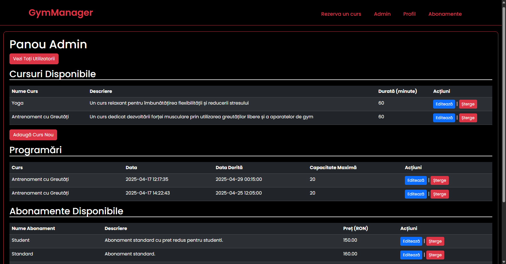

# GymManager – Web App for Gym Management

**GymManager** is a PHP & MySQL-based web application for managing a fitness center. It offers full CRUD functionalities for subscriptions, users, courses, and reservations. The platform includes both client-facing and admin interfaces, with responsive design and smooth user experience enhancements using **Bootstrap** and **fade-in animations**.

---

## Features

- 🔐 **Authentication system** (login, registration, session handling)
- 👤 **User management** (admin can view/edit/delete users)
- 📝 **Profile customization** (update personal info)
- 🧾 **Subscription system** (add/edit/delete subscriptions; users can buy)
- 📅 **Course management** (admin CRUD for courses, view schedules)
- 📆 **Reservation system** (users can book or cancel courses)
- 📊 **Admin dashboard** with reports and full control
- 💡 Responsive UI with **Bootstrap** + UI/UX enhancements

---

## Project Structure

- **`assets/`** – Images and UI assets  
- **`CSS/`** – Custom stylesheets (e.g. `style.css`)  
- **`includes/`** – Reusable PHP components:
  - `auth.php` – Authentication logic  
  - `database.php` – Database connection  
  - `navbar.php` – Navigation bar  
  - `footer.php` – Footer content  

- **`templates/`** – Main app pages:
  - `abonamente.php` – Subscription list  
  - `adauga_abonament.php` – Add new subscription  
  - `adauga_curs.php` – Add new course  
  - `rezervari.php` – View and make reservations  
  - `toti_utilizatori.php` – Admin view of all users  
  - `raport_abonamente.php` – Subscription report for admins  

- **Root files:**
  - `index.php` – Landing page  
  - `login.php` – User login page  
  - `register.php` – User registration  
  - `profil.php` – User profile management  

---

## What Was Tested

- ✅ Authentication & session protection
- ✅ CRUD operations for users, courses, subscriptions
- ✅ Course reservation logic & validation
- ✅ Admin role access control
- ✅ Interface responsiveness and usability
- ✅ Security against unauthorized access

---

## Challenges Faced

- Mapping many-to-many relationships (users ↔ subscriptions)
- Validating course capacity in real-time during reservation
- Securing admin routes from unauthenticated access
- Ensuring mobile responsiveness for all components

---

## Screenshots

| Login Page | Home Page | Admin Panel |
|-----------|-------------|-------------------|
|  |  |  |

---

## Technologies Used

- `PHP 8+`
- `MySQL`
- `HTML5, CSS3`
- `Bootstrap 5`
- `Vanilla JS`
- `Git / GitHub`

---

## Future Improvements

- 🔔 Notification system for bookings
- 💳 Online payments integration
- ⭐ User feedback & course rating
- 📅 Calendar view for courses

